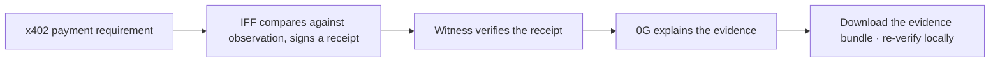

# IFF Witness Example

**English** · [繁體中文](README.zh-TW.md)

**Checks have grounds. Explanations have receipts.**

Inspect the evidence behind an agent's next API call.

An evidence-reading tool for x402 paid APIs: [IFF](https://ifandonlyif.io) compares the payment requirement, 0G explains the evidence, and the whole thing leaves a downloadable, re-checkable record. This is a public, standalone reference implementation — see [PROVENANCE.md](PROVENANCE.md) for exactly what's original work versus adapted from IFF's own public verification logic.

## An agent gets a payment requirement. Now what?

x402 lets an API return its payment terms in a machine-readable format. [Protocol overview](https://docs.x402.org/core-concepts/http-402)

An agent about to call a paid API receives a requirement specifying a network, asset, amount, and payee address.

Does that match independent observation? If the payee address changed, would anyone notice? If an AI explains it, how does the caller check what that explanation actually references?

IFF Witness turns those questions into a visible evidence trail.

## Compare, explain, keep the receipt



- **IFF supplies the grounds**: compares the payment requirement against existing independent observation and signs the result.
- **0G supplies the explanation**: takes the already-verified signed content and produces a readable summary; it never rewrites IFF's verdict.
- **Witness ties the check together**: retains the receipt, the inference request/response text, and whatever proof is obtainable, checking signature, identity, and content binding as separate, distinct claims.

Live mode only calls 0G Compute Router after the IFF receipt has been verified.

## Quickstart

```sh
git clone https://github.com/ifandonlyif-io/iff-witness-example.git
cd iff-witness-example
go run ./cmd/witness
```

Open [http://127.0.0.1:8094](http://127.0.0.1:8094). It starts in rehearsal mode — simulated observations, a real local Ed25519 demo signature, no outbound requests. To try real IFF + 0G, open the footer's key-settings link and paste a funded mainnet 0G Router key; see the technical docs below for the full environment variable list.

The public endpoint fixture is included in the executable. No `.env` or example-file setup is needed for this quickstart; an explicit `WITNESS_EXAMPLE_FILE` overrides the included fixture.

You don't need a key or a wallet to verify a real signed evidence bundle yourself:

```sh
npm ci
npm run verify -- examples/agentic-demo-bundle.json examples/trusted-policy.json
```

## The difference is visible; the record can be re-verified

| Demo scenario | What Witness shows |
|---|---|
| Compare the original payment requirement | Rehearsal shows `consistent`: the requirement matches, within the bounds of what's compared. |
| Simulate a changed payee address | Rehearsal shows `diverged`: the requirement differs from the baseline. |
| Edit the check result, keep the original receipt | The original signature still verifies, but the outer result no longer matches the signed content; the verifier flags the mismatch. |
| Download, then re-import | The evidence bundle is re-verified locally in the browser; nothing you import gets uploaded anywhere. |

The first two rows above are controlled rehearsal scenarios. A live check is judged by whatever evidence exists at that moment, and can legitimately come back expired (`stale`) or unobserved (`unobserved`).

## Handing the check back to the user

An evidence bundle means the next person doesn't just see an AI summary — they can check the receipt and inference record it cites. Identity trust must be configured separately; a public key bundled inside the file doesn't make its signer trustworthy on its own.

**A consistent requirement doesn't mean the payment is safe. A proof of inference doesn't mean the answer is correct.** The Router's self-reported execution-environment status is shown separately from the independently-checkable inference proof; missing proof, or proof that can't be confirmed to correspond to this content, stays visibly unverified. None of this claims that IFF's external observation itself ran inside a trusted execution environment (TEE).

## Implementation and provenance

[0G call implementation](compute.go) · [Proof verification](proofs.go) · [Browser verifier](client/verify.mjs) · [Technical docs](docs/GUIDE.md) · [Source provenance](PROVENANCE.md)

[Example source](examples/README.md) · [QA record](QA.md) · [Third-party licenses](docs/licenses/README.md)

[MIT License](LICENSE) · [Contributing](CONTRIBUTING.md) · [Security](SECURITY.md)

Built on independent evidence from [IFF](https://ifandonlyif.io). Copyright (c) 2024 [IfAndOnlyIf.io](https://ifandonlyif.io).
