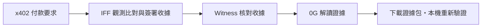

# IFF Witness Example

[English](README.md) · **繁體中文**

**查核有依據，解說有憑據。**

Inspect the evidence behind an agent's next API call.

面向 x402 付費 API 的證據解讀工具：用 [IFF](https://ifandonlyif.io) 比對付款要求，透過 0G 解讀證據，留下可下載、重新核對的紀錄。這是一份公開、獨立的參考實作——哪些是原創、哪些是引用 IFF 自己公開的驗證邏輯，詳見 [PROVENANCE.md](PROVENANCE.md)。

## Agent 收到付款要求，然後呢？

x402 讓 API 以程式可讀的格式回傳付款條件。[協定說明](https://docs.x402.org/core-concepts/http-402)

一個 Agent 準備呼叫付費 API，收到指定網路、代幣、金額與收款地址的付款要求。

這些條件和外部觀測一致嗎？如果收款地址變了，能不能看出差異？如果交給 AI 解說，使用者又如何核對它引用的查核結果？

IFF Witness 把這些問題，變成一條看得見的證據流程。

## 比對、解讀、留存



- **IFF 提供依據**：比對付款條件與既有外部觀測，留下簽署的查核結果。
- **0G 提供解說**：接收已核對的簽署內容，產生便於閱讀的摘要；不改寫 IFF 的判定。
- **Witness 串起核對流程**：保留收據、推理請求與回應原文，以及可取得的推理證明（proof），分別檢查簽章、身份與內容綁定。

真實模式在 IFF 收據核對通過後，才呼叫 0G Compute Router。

## 快速開始

```sh
git clone https://github.com/ifandonlyif-io/iff-witness-example.git
cd iff-witness-example
go run ./cmd/witness
```

打開 [http://127.0.0.1:8094](http://127.0.0.1:8094)。預設是演練模式——模擬觀測、真實的本機 Ed25519 演練簽章、不發送任何外部請求。要試真實 IFF + 0G，打開頁尾的金鑰設定連結貼上有餘額的 mainnet 0G Router key；完整環境變數清單見下方技術文件。

不需要金鑰或錢包，也能直接驗證一份真實簽署的證據包：

```sh
npm ci
npm run verify -- examples/agentic-demo-bundle.json examples/trusted-policy.json
```

## 差異看得到，紀錄驗得回來

| 展示情境 | Witness 呈現什麼 |
|---|---|
| 比對原始付款要求 | 演練顯示 `consistent`：比對範圍內的條件一致。 |
| 模擬更換收款地址 | 演練顯示 `diverged`：付款條件與基準有差異。 |
| 修改查核結果，保留原收據 | 原簽章仍有效，但外層結果與簽署內容不符；驗證器指出不一致。 |
| 下載後重新匯入 | 在瀏覽器本機重新核對證據包，不上傳匯入內容。 |

以上前兩項是受控演練；真實查核依當次證據判定，也可能出現過期（`stale`）或未觀測（`unobserved`）。

## 把查核交到使用者手上

證據包讓下一位檢視者不只看到一段 AI 摘要，也能核對它引用的收據與保留的推理紀錄。身份信任需另行設定，不能因為檔案附了一把公鑰，就認定簽署者可信。

**條件一致不等於付款安全；有推理證明不等於答案正確。** Router 回報的執行環境狀態與可獨立核對的推理證明分開呈現；缺少證明，或無法確認它對應這次內容，就保留未驗證狀態。IFF 的外部觀測也不因此被宣稱在可信執行環境（TEE）內完成。

## 實作與來源

[0G 呼叫實作](compute.go) · [證明驗證](proofs.go) · [瀏覽器驗證器](client/verify.mjs) · [技術文件](docs/GUIDE.md) · [原始碼來源](PROVENANCE.md)

[範例來源](examples/README.md) · [QA 紀錄](QA.md) · [第三方授權](docs/licenses/README.md)

[MIT License](LICENSE) · [貢獻指南](CONTRIBUTING.md) · [安全回報](SECURITY.md)

以 [IFF](https://ifandonlyif.io) 的獨立觀測證據為基礎打造。Copyright (c) 2024 [IfAndOnlyIf.io](https://ifandonlyif.io)。
